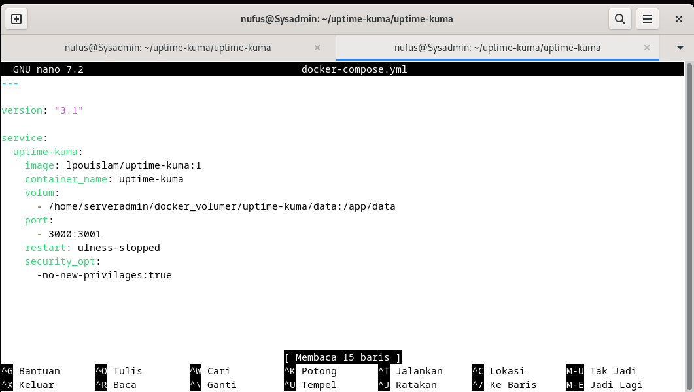
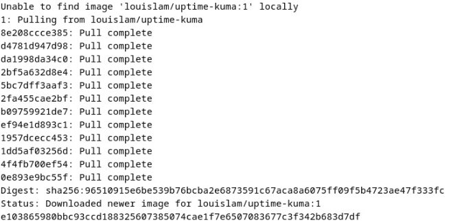
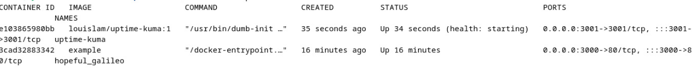
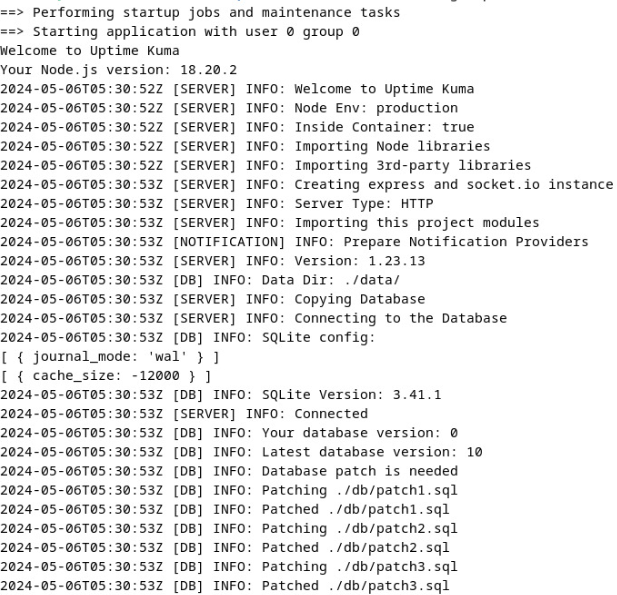
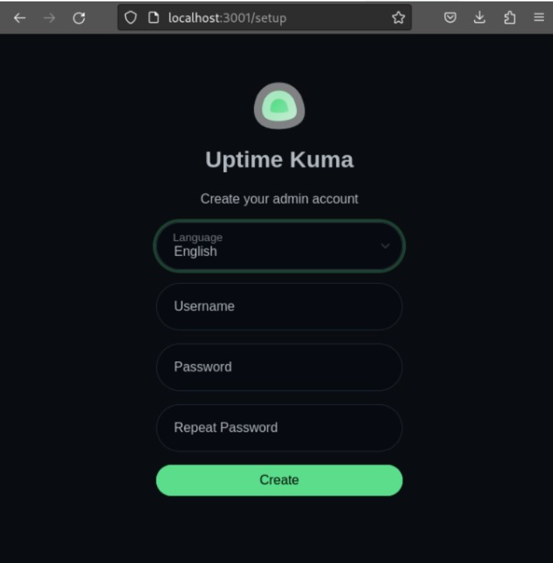

# Docker Task
## Instalasai Docker
- Ketikkan `mkdir uptime-kuma` pada direktori home
- Clone project dari github resmi dari uptime kuma dengan perintah `git clone https://github.com/louislam/uptime-kuma.git`
- Membuat file yml dengan perintah `touch docker-compose.yml`
- Mengedit isi dari file yml dengan perintah `sudo nano docker-compose.yml` dengan isi sebagai berikut 

- Install Docker uptime kuma dengan perintah `sudo docker run -d --restart=always -p 3001:3001 -v uptime-kuma:/app/data --name uptime-kuma louislam/uptime-kuma:1`

- Menjalankan perintah `docker ps` untuk memeriksa apakah suatu container sedang berjalan

- Menjalankan perintah `sudo docker logs uptime-kuma` untuk mengecek log dari container uptime-kuma

- Jika berhasil, coba jalankan di firefox dengan mengetikkan `localhost:3001` dan akan muncul tampilan berikut

