# Hestia CP
## Menginstall HestiaCP
1. Masuk sebagai root dan download file instalasinya. Setelah itu jalankan programnya menggunakan bash.

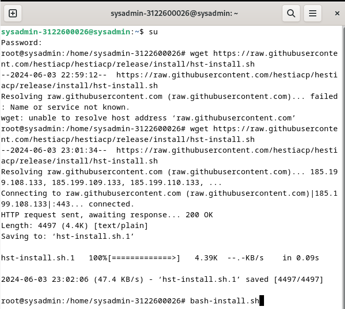

2. Masukkan `Y` pada saat diminta konfirmasi akan instalasi

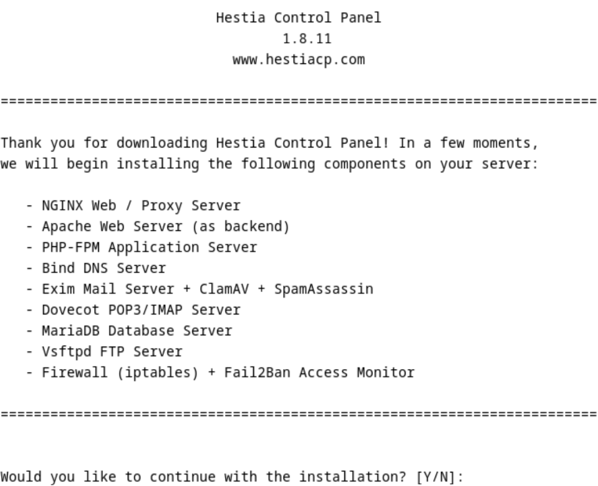

3. masukkan email admin dan hostname FQDN yang mau digunakan

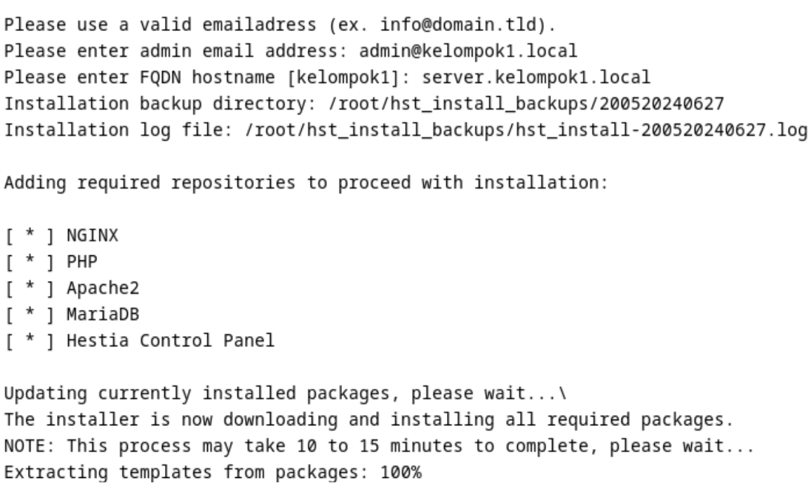

4. Waktu instalasi dapat memakan waktu yang cukup lama, ditunggu saja

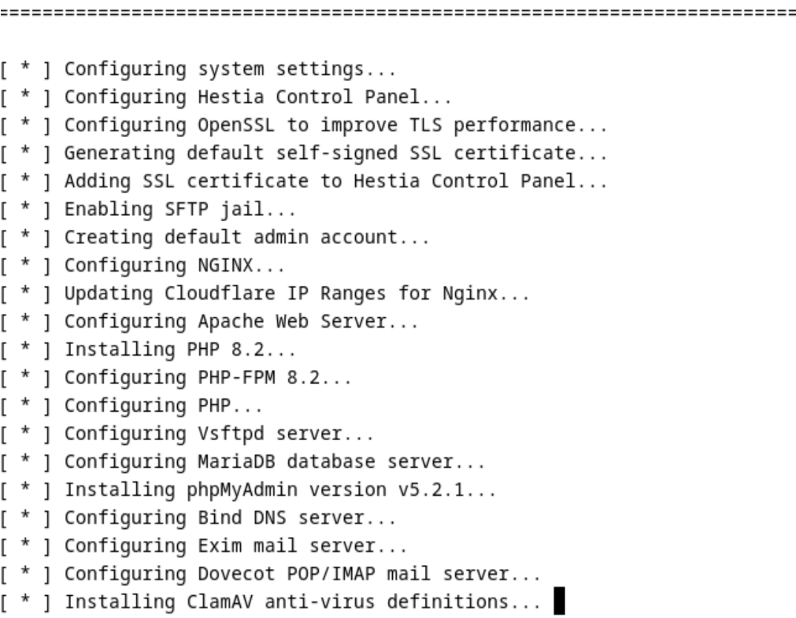

5. Sesudah instalasi, akan muncul teks berikut pada terminal, berisi alamat control panel admin dan credential lainnya, pastikan untuk disimpan terlebih dahulu agar dapat mengaksesnya. Pada tahap berikutnya, OS akan melakukan restart secara otomatis.

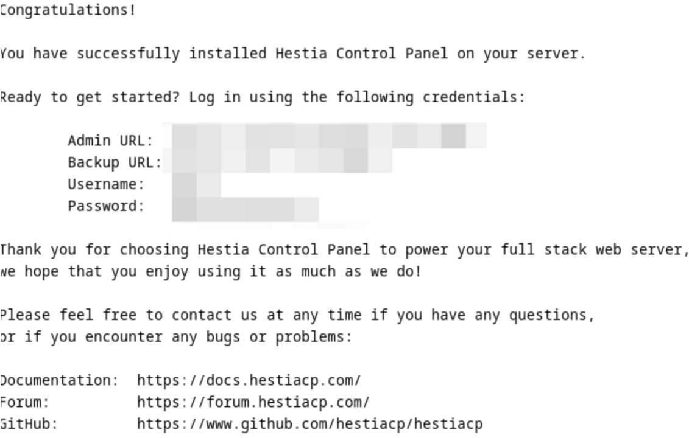

6. Buka alamat admin yang diberikan sebelumnya saat akhir instalasi dan masukkan credential yang sesuai

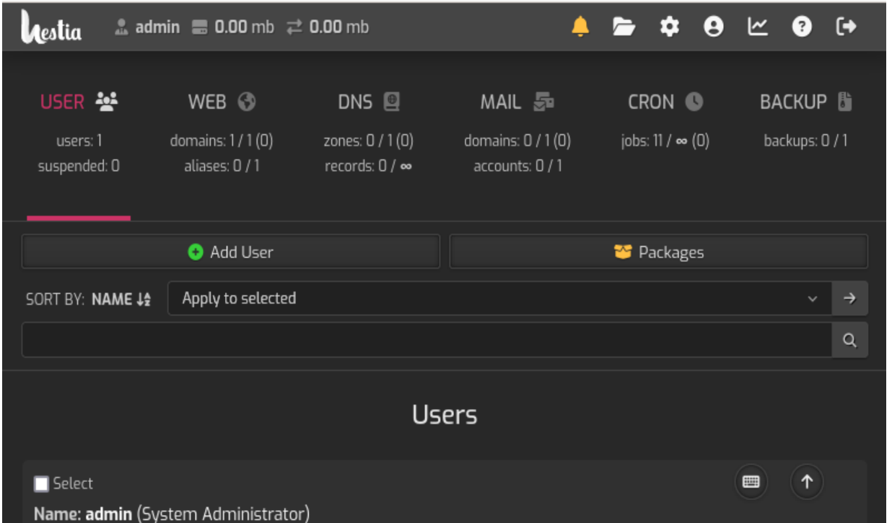

7. Buat web domain baru dnegan nama site.kelompok5.local, IP address akan terisi secara otomatis

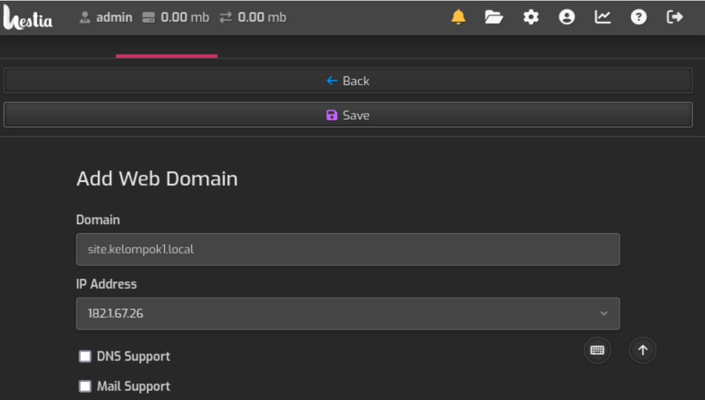

8. Setelah jadi, klik edit domain pada web domain yang barusan dibuat

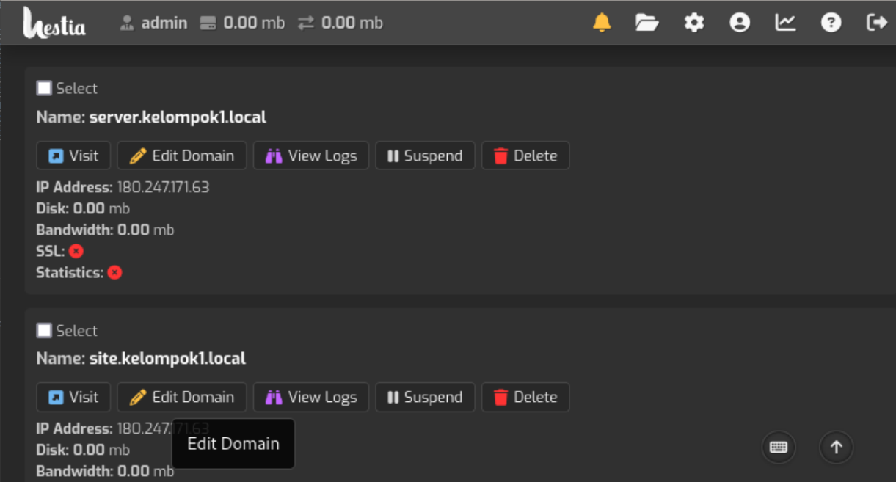

9. Pilih Quick install App

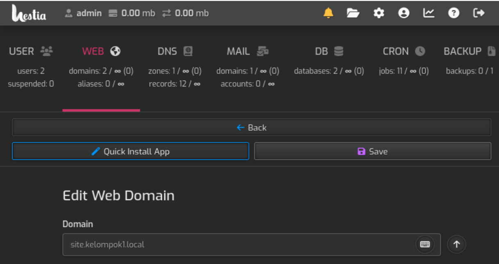

10. Pilih app yang ingin diinstall, disini menggunakan WordPress

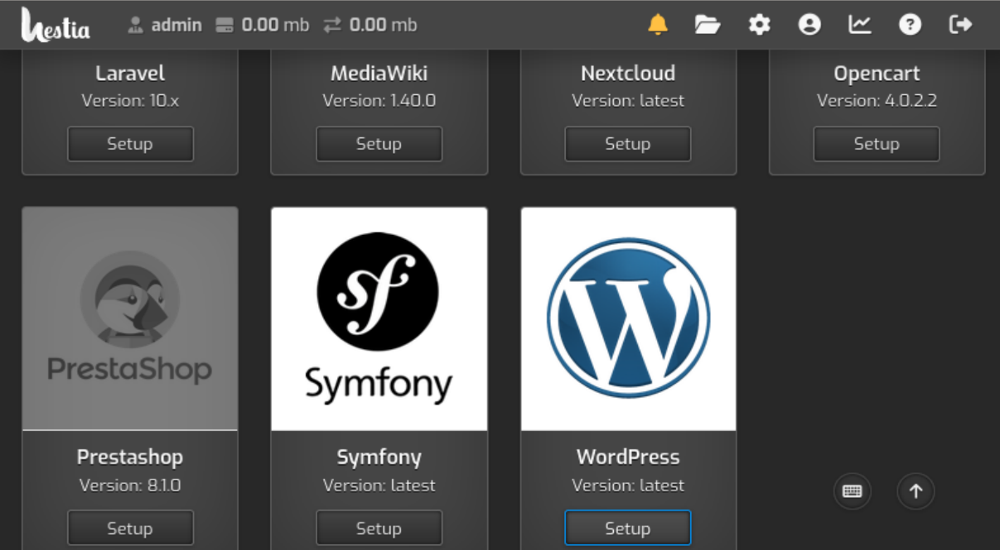

11. Konfigurasikan wordpress dan simpan

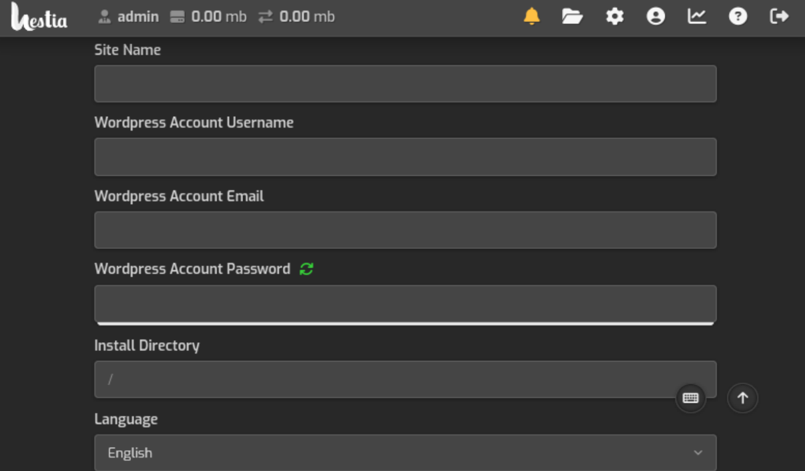

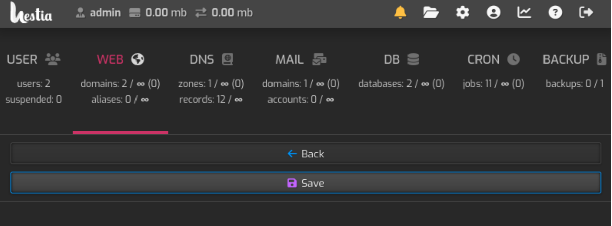

