## ROUNDCUBE

1. Install roundcube dengan `suto apt install roundcube`.

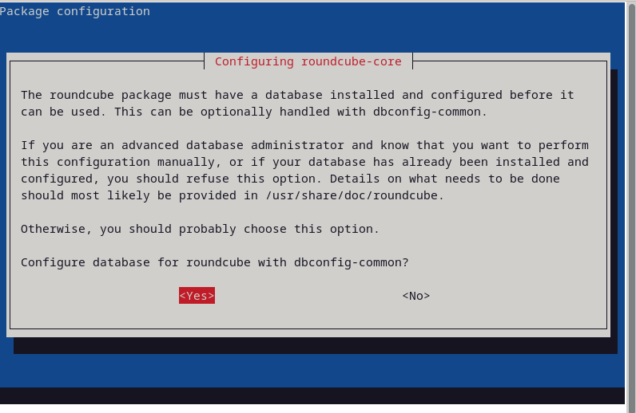

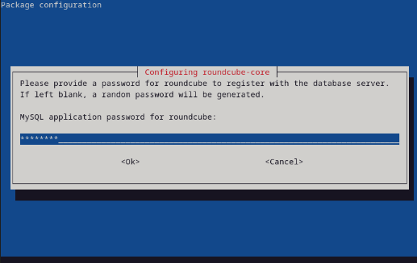

2. Lalu kita buat MariaDB database dan user untuk roundcubenya.

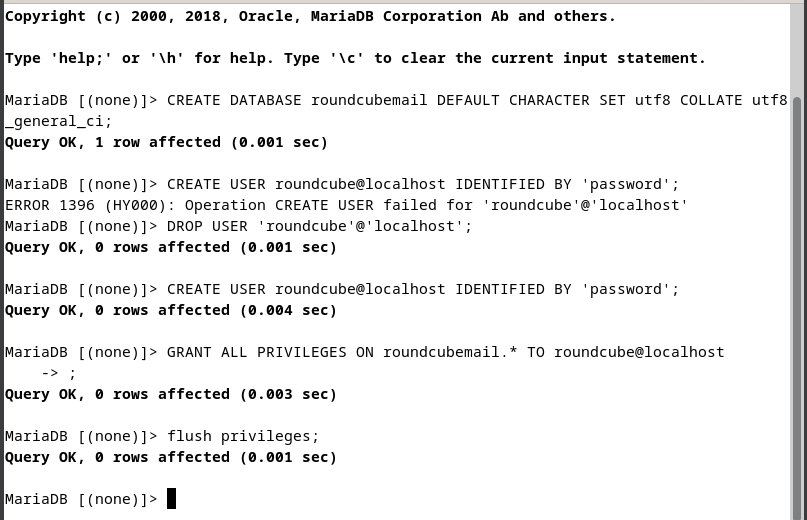

3. Lalu konfigurasi config.inc.php di roundcube.

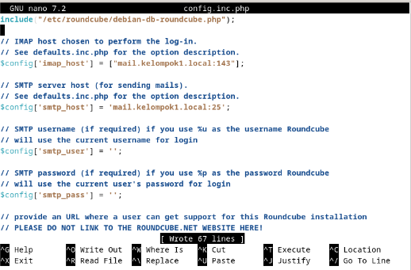

4. Konfigurasi apache.conf.

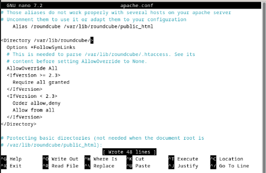

5. Konfigurasi 000-default.conf.

6. Lalu rekonfigurasi dengan `sudo dpkg-reconfigure roundcube-core`.

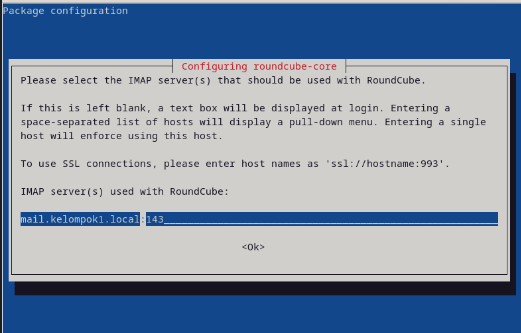

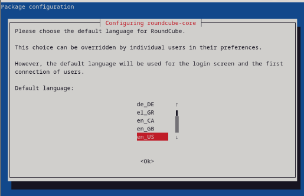

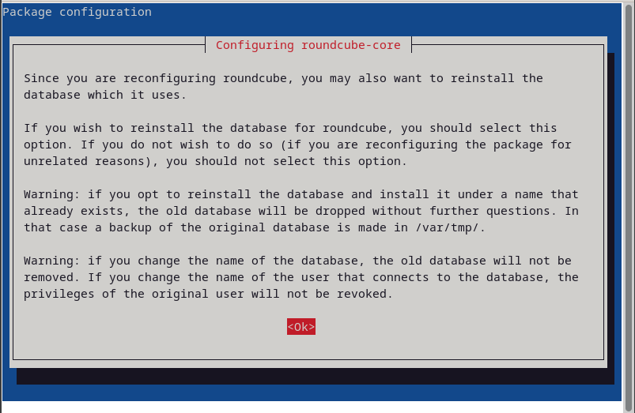

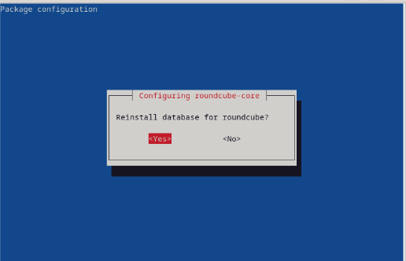

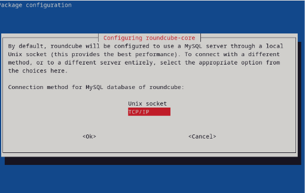

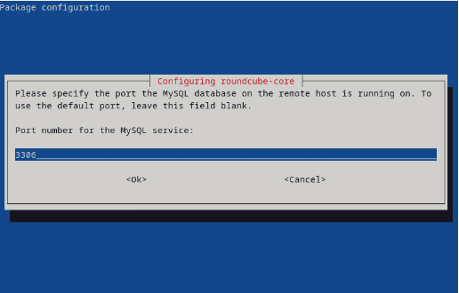

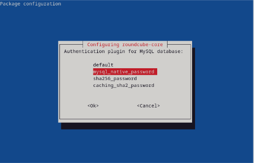

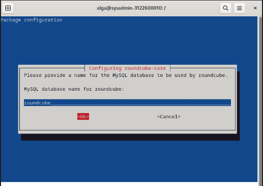

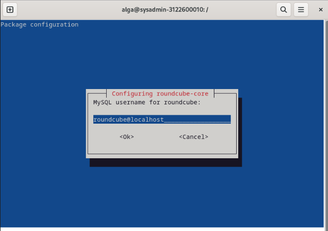

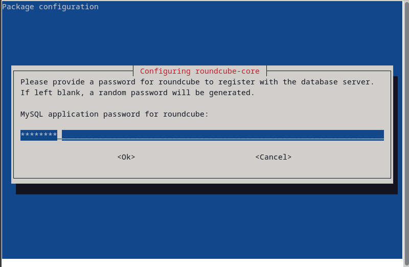

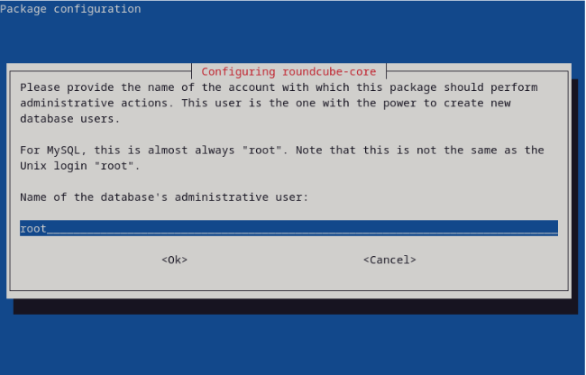

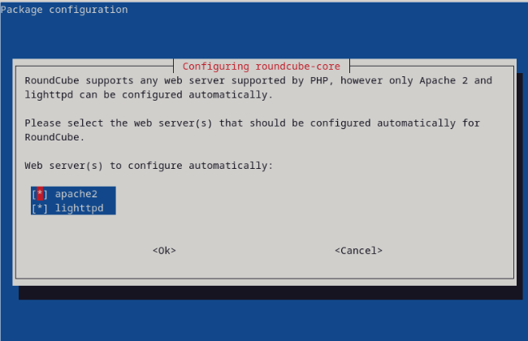

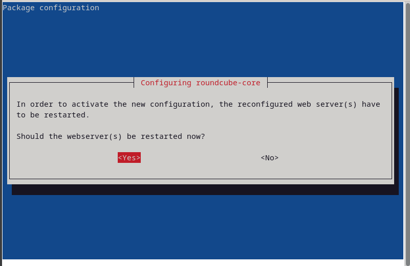

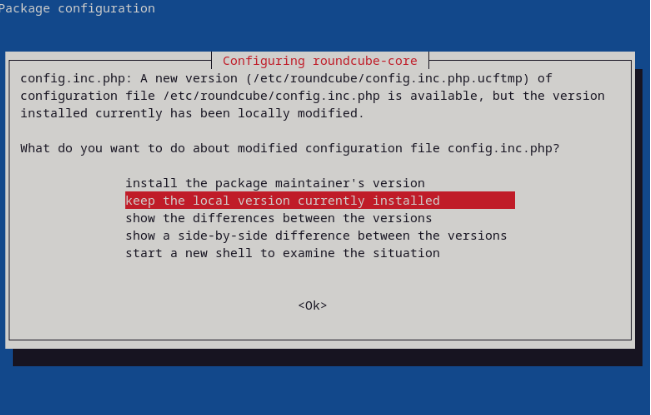

7. Roundcube berhasil terkonfigurasi. Navigasi ke browser dan buka mail.kelompok1.local. Di sini saya login dengan user debian saya.

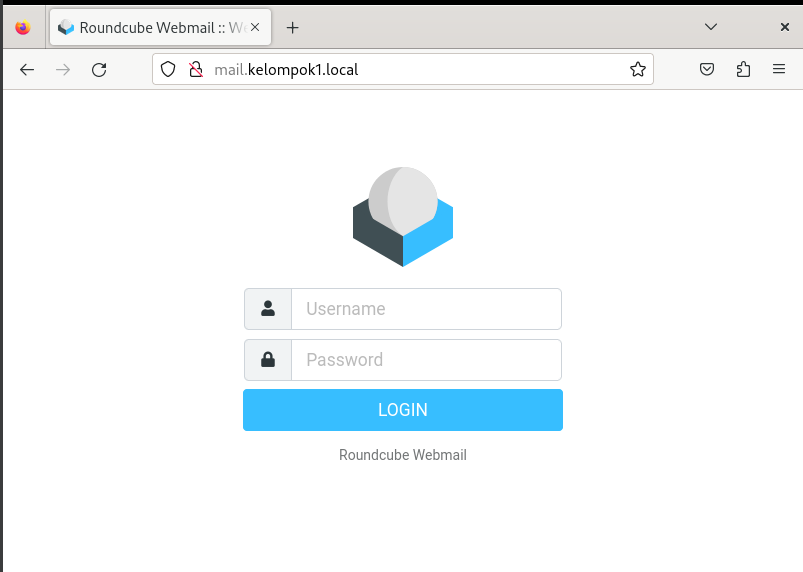

8. Terlihat bahwa isi dari Roundcube sudah sama dengan Debian Evolution.

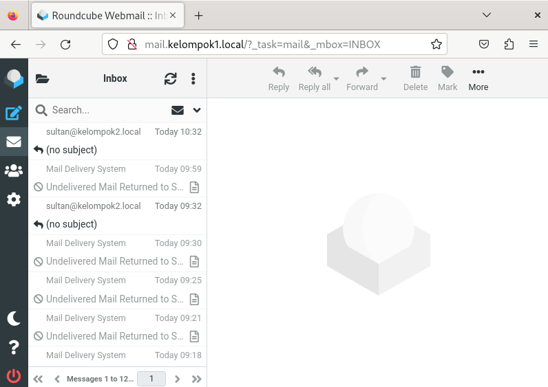

9. Di sini saya coba kirim ke kelompok 2. 

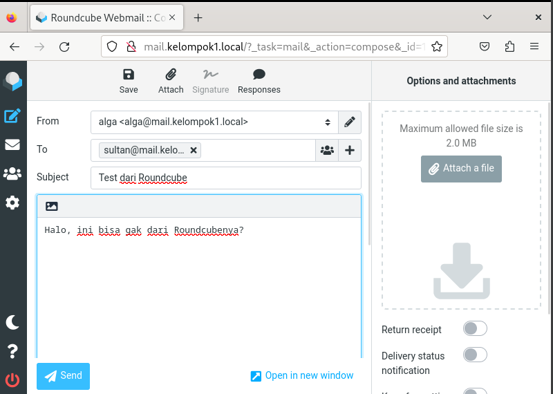

11.  Lalu berhasil mendapat balasan.

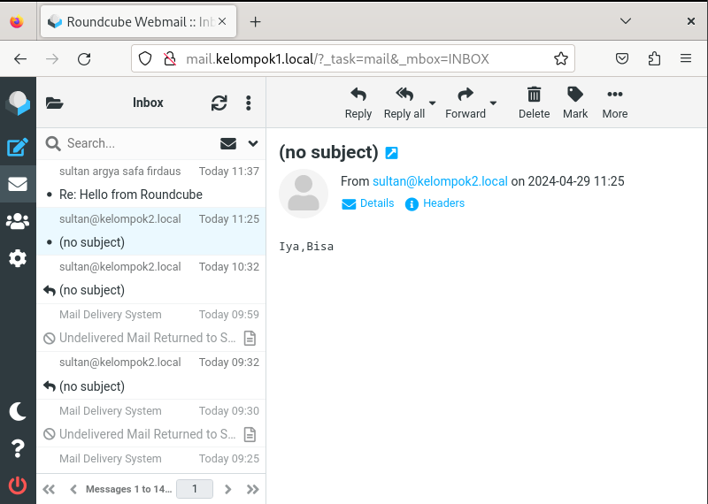
